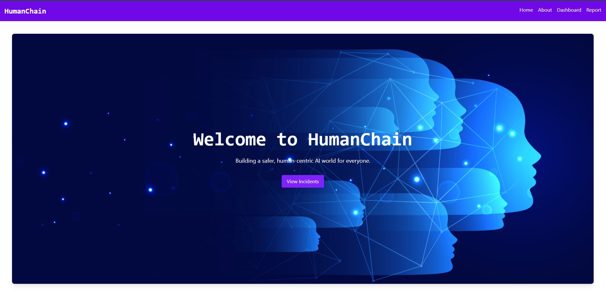
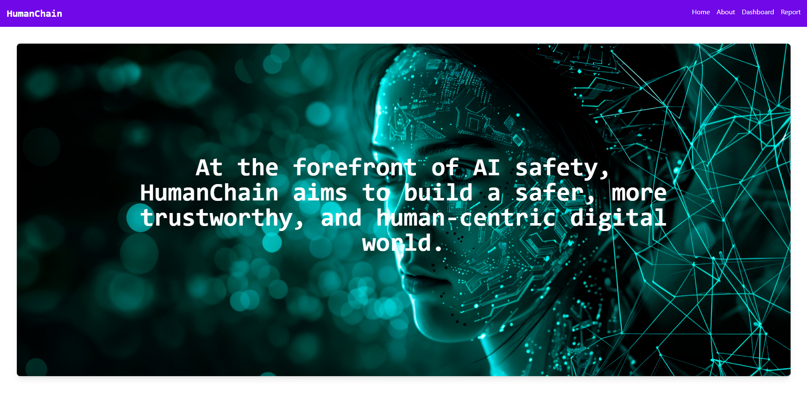
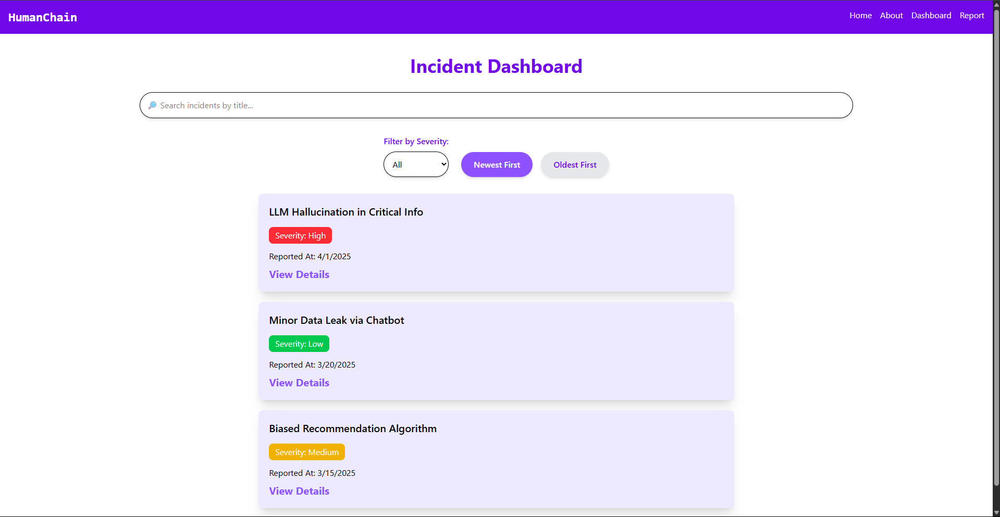
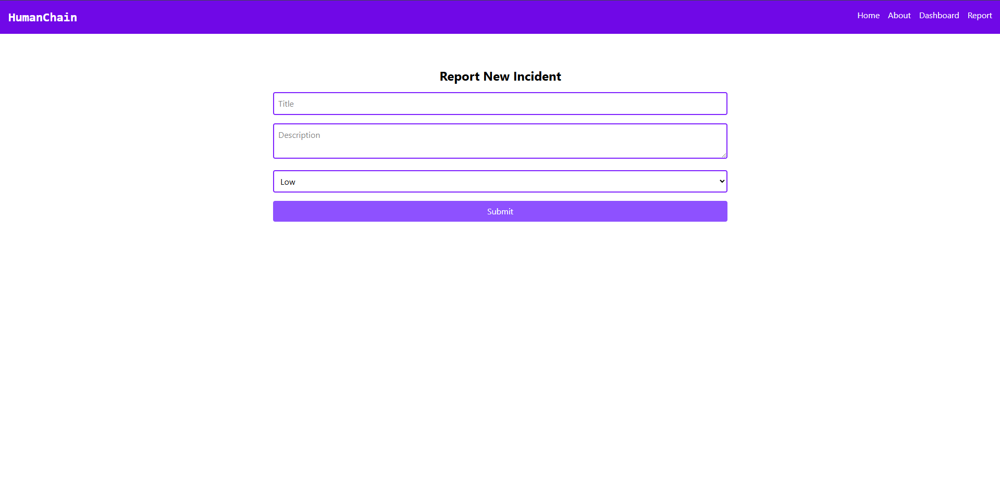

# Sparklehood - HumanChain Assignment 🚀

> Frontend Take-Home Assignment for **HumanChain** – Building an **AI Safety Incident Dashboard** with React, Vite, and TailwindCSS.

Live Demo: [sparklehood-humanchain-assignment.vercel.app](https://sparklehood-humanchain-assignment.vercel.app/)

GitHub Repo: [Sparklehood-HumanChain-Assignment](https://github.com/Aaditya-Kumar-Mittal/Sparklehood-HumanChain-Assignment.git)

---

## 🛠️ Project Structure

```plaintext
/src
  /assets       (Images and static files)
  /components
    Loader.jsx
    Navbar.jsx
    HeroSection.jsx
    IncidentDashboard.jsx
    IncidentList.jsx
    IncidentItem.jsx
    NewIncidentForm.jsx
  /pages
    Home.jsx
    About.jsx
    Dashboard.jsx
    Report.jsx
  /context
    IncidentContext.jsx
  App.jsx
  index.js
  index.css    (TailwindCSS setup)
```

---

## 🚀 Tech Stack

- **React** (with Vite for faster development)
- **TailwindCSS** (for responsive, modern styling)
- **React Context API** (for state management)
- **Vercel** (for live deployment)

---

## 🧩 Features

- Loader page with smooth transition
- Navbar with routing to:
  - Home (Hero Section)
  - About Us page
  - Incident Dashboard (View and Manage incidents)
  - Report New Incident page
- Incident Dashboard:
  - **Dropdown** to filter incidents by Severity
  - **Sort** incidents by Newest / Oldest
  - **Live Search** by Incident Title
  - **Expandable Details** for each incident
- New Incident Form:
  - Add new incidents dynamically (valid for current session)
  - Basic input validation
- Responsive and mobile-friendly design

---

## 🛠️ How to Run Locally

1. **Clone the repository:**

   ```bash
   git clone https://github.com/Aaditya-Kumar-Mittal/Sparklehood-HumanChain-Assignment.git
   ```

2. **Navigate into the project directory:**

   ```bash
   cd Sparklehood-HumanChain-Assignment
   ```

3. **Install dependencies:**

   ```bash
   npm install
   ```

4. **Run the development server:**

   ```bash
   npm run dev
   ```

---

## 📚 Design Decisions and Challenges

- **State Management:** Chose React Context API for simple and scalable state management without introducing Redux.
- **Session Persistence:** Incidents are stored only in memory for the current session as per assignment requirements.
- **Responsiveness:** TailwindCSS was selected for fast, mobile-first, and clean UI.
- **Loader & Navigation:** Smooth UX flow with a loader screen and intuitive navigation.
- **Filter Improvements:** Initially used buttons for severity filter but upgraded to a **dropdown** for a cleaner professional dashboard look.

---

## 📸 Screenshots

| Home                                      |
| :---------------------------------------- |
|            |
| About                                     |
|          |
| Dashboard                                 |
|  |
| Report                                    |
|        |

---

## 📃 License

This project is intended solely for the purpose of **Sparklehood - HumanChain Assignment**.

---

Made with 🎯 for HumanChain's mission of **AI Safety and Trust** by Aaditya Kumar Mittal

---
